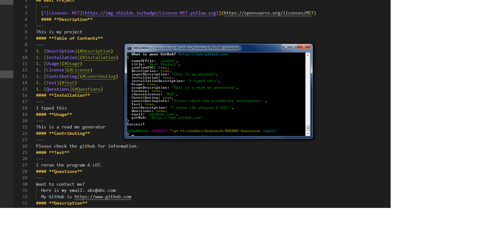

## **Good README Generator**

---

#### **Table of Contents**

---

1. [Installalation](#installation)
1. [Trials](#trials)
1. [Usage](#usage)
1. [Credits](#credits)
1. [License](#license)

#### **Installation**

---

The steps you need to take to install this are:

1. Figure out what your read me needs to look like.
1. Install dependencies which must include inquirer.
1. Write the questions for the user to be prompted by inquirer.
1. Make functions to return the values for each section of the README.
1. Assemble the returns into a file and then write it to the markdown file.

#### **Trials**

---

This project taught me how to use export.module extremely well. You can export many functions at once with {} around them. In addition, I learned how to use inquirer quite well. The when function is truly amazing and versatile.

#### **Usage**

---

The usage of this CLI is fairly simple. You start with a command prompt.
Start the program and follow the prompts. Enter values as you wish. If you select no to a section, that section will not be produced. Once all the prompts have been answered a file named how you chose will populate.

The application is deployed [here](https://github.com/jerler1/README-Generator).

#### **Credits**

---

Thanks to Bradley for the good discussion on exporting modules.

#### **License**

---

Copyright (c) 2005-2020 David Heinemeier Hansson

Permission is hereby granted, free of charge, to any person obtaining
a copy of this software and associated documentation files (the
"Software"), to deal in the Software without restriction, including
without limitation the rights to use, copy, modify, merge, publish,
distribute, sublicense, and/or sell copies of the Software, and to
permit persons to whom the Software is furnished to do so, subject to
the following conditions:

The above copyright notice and this permission notice shall be
included in all copies or substantial portions of the Software.

THE SOFTWARE IS PROVIDED "AS IS", WITHOUT WARRANTY OF ANY KIND,
EXPRESS OR IMPLIED, INCLUDING BUT NOT LIMITED TO THE WARRANTIES OF
MERCHANTABILITY, FITNESS FOR A PARTICULAR PURPOSE AND
NONINFRINGEMENT. IN NO EVENT SHALL THE AUTHORS OR COPYRIGHT HOLDERS BE
LIABLE FOR ANY CLAIM, DAMAGES OR OTHER LIABILITY, WHETHER IN AN ACTION
OF CONTRACT, TORT OR OTHERWISE, ARISING FROM, OUT OF OR IN CONNECTION
WITH THE SOFTWARE OR THE USE OR OTHER DEALINGS IN THE SOFTWARE.
